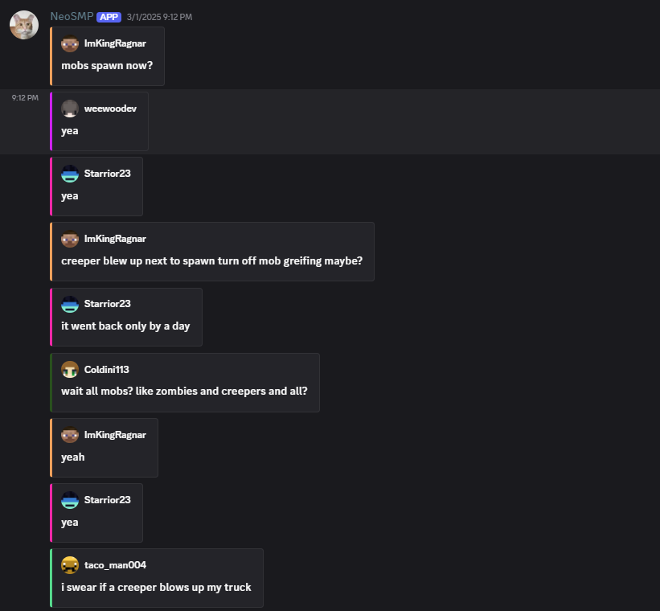

# EtherLink
A lightweight system for linking Minecraft servers and Discord in real time.

EtherLink connects your Minecraft server (via Fabric mod or Paper plugin) to a custom Discord bot using WebSockets. It syncs in-game chat messages to Discord with player usernames, avatars, and uniquely generated colors, and it keeps Discord updated with the server’s live status.

---

## Features

### Cross-platform integration
- Fabric mod and Paper plugin (Minecraft **1.21**)
- Connects to a Python Discord bot over WebSockets
- Supports **multiple server connections** at once — link as many Minecraft servers as you want to different Discord servers

### Real-time chat relay
- Mirrors all in-game chat messages to a designated Discord channel
- Each message includes:
  - Player username
  - Color generated from the username (stable per user)
  - Player avatar based on their Minecraft skin
- Messages are enumerated and formatted for readability

### Server status in Discord
- Shows current online player count when the server is up
- Displays “offline” when the server goes down
- Updates automatically when players join or leave

### Reliable connection system
- Both the bot and server automatically **reconnect** if the WebSocket connection drops
- The Discord bot includes commands for **registering and managing new server connections**
- Connections persist across restarts, keeping everything stable and consistent

### Smart whitelist command
- The Discord bot includes a **whitelist command** for adding players directly from Discord
- Automatically detects whether a player is **Java** or **Bedrock** and handles the process accordingly
- Simplifies cross-platform management without requiring in-game commands

---

## How it works

1. The Minecraft mod/plugin opens a persistent WebSocket connection to the Discord bot.
2. Game events (chat, join, leave, server status) are sent as structured payloads.
3. The bot formats and posts messages to a Discord channel in real time.
4. If either side disconnects, EtherLink automatically attempts to reconnect.

This avoids slow polling and reduces API overhead while keeping latency low and uptime consistent.  

---

## Quick start

1) Clone the repo

    git clone https://github.com/TreverFuhrer/EtherLink

2) Set up the Discord bot
   - Create a Discord application and bot, invite it to your server.
   - Configure the bot with your Discord token in a `.env` file.
   - Start the bot.

3) Install on your Minecraft server (choose one)
   - Fabric (1.21): drop the EtherLink Fabric mod jar into `mods/`
   - Paper (1.21): drop the EtherLink Paper plugin jar into `plugins/`

4) Configure the connection
   - Set up an additional port on your Minecraft server.
   - Using bot commands, allow connections from your server’s IP/domain.

5) Start the Minecraft server
   - The server connects to the bot automatically.
   - Chat, status, and whitelist management begin working immediately.

---

## Configuration

Because this project is split into a server component (Java) and a bot (Python), each side needs minimal configuration:

- **Minecraft side (Fabric/Paper)**
  - WebSocket endpoint (host:port or wss URL)

- **Discord bot (Python)**
  - Discord bot token
  - Commands for registering new Minecraft servers
  - Whitelist management for Java and Bedrock players

---

## Compatibility

- **Minecraft:** 1.21 (more versions planned)
- **Server platforms:** Fabric, Paper
- **Languages:** Java (mod/plugin), Python (Discord bot)

---

## Screenshots

---

## Roadmap

- Version support matrix beyond 1.21
- Improved reconnect and error handling
- World event commands
